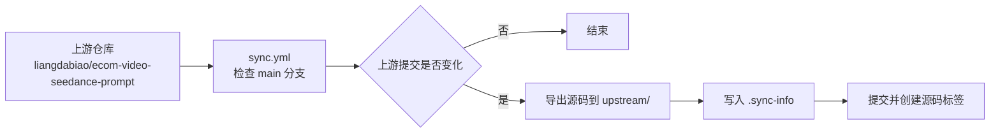

<div align="center">

# EcomAI-Bak

ecom-video-seedance-prompt 上游仓库的源码镜像

[](https://github.com/liangdabiao/ecom-video-seedance-prompt)
[](https://github.com/liangdabiao/ecom-video-seedance-prompt/tree/main)
[](https://github.com/hopol/EcomAI-Bak/actions/workflows/sync.yml)
[](LICENSE)

[上游仓库](https://github.com/liangdabiao/ecom-video-seedance-prompt) · [Actions](https://github.com/hopol/EcomAI-Bak/actions)

</div>

---

## 📌 说明

本仓库用于镜像 [`liangdabiao/ecom-video-seedance-prompt`](https://github.com/liangdabiao/ecom-video-seedance-prompt) 的源码。

- 源码来自上游 `main` 分支，导出到 `upstream/`。

- 本仓库不修改上游源码，不提供上游项目的官方支持。

> [!NOTE]
> 上游项目描述：这是一个基于deepseek-v4-flash-vision 视觉deepseek大模型的复刻带货爆款视频Skill, 会生成复刻效果的seedance提示词！  > 你刷到一条带货爆款视频，想让 AI 照着再来一条——本 skill 就是那个"翻译官"： > 它把视频**看懂**（拆成一张张镜头卡片），再把卡片**翻译**成即梦（Seedance） > 能直接执行的提示词。你拿到手的，是一套可以直接粘贴进即梦的完整提示词包。。功能说明、安装方式、更新内容和使用要求请以上游仓库为准。

## 📁 镜像范围

| 内容 | 位置 | 说明 |
|---|---|---|
| 上游源码 | `upstream/` | 通过 `git archive` 从上游 `main` 分支导出。 |
| 同步信息 | `upstream/.sync-info` | 记录上游提交、同步时间、分支和版本或来源引用。 |
| 源码标签 | `mirror-source-…` | 对应一次源码同步。 |

## 🔄 自动同步



> [!IMPORTANT]
> GitHub Actions 中的定时任务使用 UTC 时间。cron 表达式的日期字段为 `*/5`，通常在每月 1、6、11、16、21、26、31 日运行，并不等同于严格每 5 天运行一次。

## 🧾 同步信息

```ini
commit=0123456789abcdef...
timestamp=2026-08-07T00:00:00Z
upstream_url=https://github.com/liangdabiao/ecom-video-seedance-prompt
upstream_branch=main
source_ref=0123456
```

`source_ref`：上游没有可可靠读取的版本文件，使用 `git describe --tags` 的来源引用。

同步脚本会在删除 `upstream/` 前读取已提交的 `.sync-info`。只有上游提交变化时，才会更新源码、创建提交和标签。

## 💻 本地同步源码

`sync.sh` 用于本地手动同步源码。它需要 Git、Bash 环境（Linux、macOS、WSL 或 Git Bash）和对镜像仓库的推送权限。

```bash
git clone https://github.com/hopol/EcomAI-Bak.git
cd EcomAI-Bak
chmod +x sync.sh
./sync.sh
```

## 🛠️ 维护常用命令

```bash
# 查看当前镜像对应的上游提交
git show HEAD:upstream/.sync-info

# 列出镜像标签
git tag -l 'mirror-*'

# 手动拉取上游分支
git fetch upstream main --tags
```

## ⚖️ 许可证

- 本仓库的同步脚本、GitHub Actions 工作流和文档采用 [MIT License](LICENSE)。
- `upstream/` 中的内容受上游许可证约束。GitHub API 报告的上游许可证为：`未声明`。

---

<div align="center">

本仓库只是镜像，不是上游项目官方仓库。

[返回顶部](#ecomai-bak)

</div>
